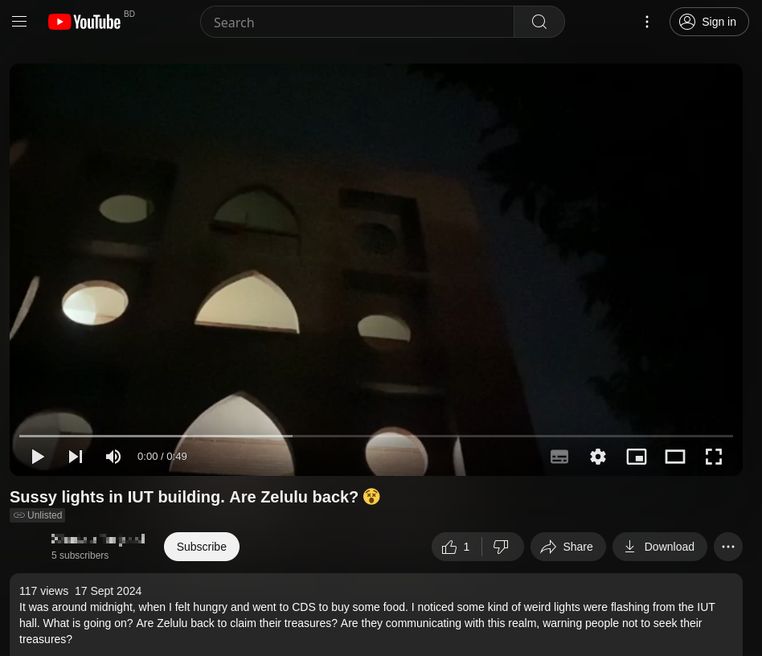
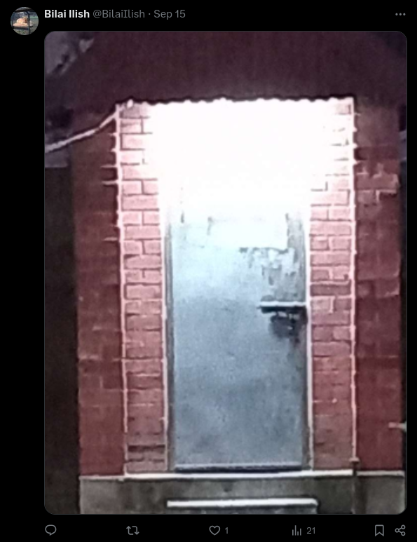

### Question 1
---

Your journey starts from here

FT2024{Ohw wkh txhvw ehjlq}

##### Walkthrough
---

This is a Caeser cipher. It is a substitution cipher where each letter is replaced by another letter by a fixed number(called offset) down the alphabet. This method is named after Julius Caesar, who used it in his private correspondence.

You can use any online cipher identifier. Search for "cipher identifier".

***dcode.fr*** is an amazing website for detecting different types of cipher,  https://www.dcode.fr/cipher-identifier . You can also decrypt here.

Ans: ***CQ2024{Let the quest begin}***

### Question 2
---

Lost in a sea of symbols, a hidden message awaits discovery. Armed with only 8 commands, navigate the chaotic maze of +, -, >, <, [, ], ., and ,. Adjust the code, unlock the cipher, and reveal the secret.

**++++++++++[>+>+++>+++++++>++++++++++<<<<-]>>>---.++++++++++++++.<++++++++++++++++++++.--.++.++.>>+++++++++++++++++++++++.<+++.>-------------------.---.<<--------------------.>>----.++++++++++++++++++++.<++++++++++++++++.+++++.>-.-----.+++.<.>+++.<++++.<.>--------.--.+++++.>------.<---.-.<.>>---.+++.++++++.<.++++++++.>++++.++++.**

##### Walkthrough
---

If you search this lines in online, they refers to a programming language called Brainfuck cipher. It is basically an esoteric programming language.

You can search for any brainfuck cipher decoder online, and decode it.

Ans : ***CQ2024{The auditorium echoed loudly}***

### Question 3
---

The place: 101
The face:

****

The date (dd/mm/yyyy): ?

##### Walkthrough
---

This is a image of Begum Khaleda Zia. There is a memorial plaque on the wall of Registrar building in remembrance of the ingauguration OIC Conference by her. 

The question basically asks you a date which you can see on that plaque, 29 October, 2001

Ans : ***29/10/2001***

Also there is a number on the floor infront of the plaque, *101*

### Question 4
---

A large number of students make their way to IUT every year. Many people bid farewell to this place yearly as well. What better place to move to once you are done with Gazipur er dhulabali?

You are looking for a shiny European city!

****

##### Walkthrough
---

This type of problem is called OSINT, Open Source Intelligence, an analysis of data gathered from open sources.

Seeing this photo, what you can do is that search it in Google image search which is a powerful image search tool.

The first image looks very much similar to the image that is given in the question. You can click on that link.

In the website, you can see the location.

The city is Rotterdam which is in Netherland.

Ans : ***CQ2024{Rotterdam}***

### Question 5
---
A stranger light has been seen flickering at the men's hall. Devout followers of Batash Khan whispers that it could be a sign, while others dismiss it as nothing more than students playing tricks. What could the truth be?

`https://www.youtube.com/watch?v=AMYbPWp2-LQ`

https://github.com/user-attachments/assets/a45e53d1-2375-4b06-9e34-fc00e11a1d09

##### Walkthrough
---
Going to the URL, a video loads with the following description:

The code represented by the blinking lights in the video is from a very well-known coding system. Nevertheless, it can be difficult to identify without some prior knowledge.

If you go the comments section...

And there's the hint. 

After decoding the morse code, it will give: `x.com/bilaiilish` as the solution, which leads to the next question.

### Question 6
---

visiting the X profile, you'll get 

In the post section, there is an image posted with nothing else.

This is a guard post beside the medical center. You'll find the next question there:

Follower of Batash Khan says he had mystic powers. But when researching, all that the archeologists could find in the ancient relics were:
`eeeeeeeeeepaeaeeeaeeeeeeeaeeeeeeeeeeccccisaaaiiijeeeeeeeeeeeeeejceeeeeeeeeeeeeeeeeeeejiijeejeejaaeeeeeeeeeeeeeeeeeeeeeeejceejaiiiiiiiiiiiiiiiiiijeeejiiiiiiijeeeeeeeeejeeeeeejcciiiiiiiiiiiiiiiiiiiijaaiiiiiiiiiiiiijeejiiiiiiiijeeeeeeeeeeeeejeeeeeejccjaaeeejiiiiiiiiiiiiiijeeeeeeeeeeejiiiiiiiiiiiijccjaaeeeeeeeeeeejiiijiiiiiiijeeeeejjiiiiijeeeeejiiiiiiijccjaaiiiiiijeeeeeeeeeeeeeeeeejiiiiijeeeeeejcceeeeeeeeeeeejiiiiiiiiiiiijaeeeeeeeeeeeeeeeejiijaiiijeeeejejiiijceeeeeeeejaiiiijciijcjaaeeeeeeeeejceejeeeeejiiiiiiiiiijceeeeeeejaaiiiijcciiiiiiijaeeejiijaiiiiijeeeeeejceeeeeeejiiiiiiijcjaiijeeeeejiiiiiiijaiijiiiiijeeeeeejeeeeeeeeeej`

##### Walkthrough
---

The google does not give any fruitful result about the cipher.

Let's ask the Chatgpt. But gpt does not also give the correct name of the cipher. You can cross check it.

Let's again ask ***decode.fr***

Bingo! It says it is a **Alphuck Cipher**. Let's decrypt it.

Ans: ***CQ2024{Silent giant with spinning arms, capturing wind's gentle charms}***

This lines indicate `windmill`. There is a windmill in `IUT`. Hope you find it.

### Question 7
---

El Macho, once the proud warrior of Tukhorian academy, now wanders the wastelands of failed admissions like a broken NPC in a glitchy RPG. His dreams of academic glory? Yeah, those fizzled out faster than a cheap firework in the rain. Now, instead of studying or, you know, sleeping, he’s found his calling: posting memes every fifteen minutes. His social media game is strong, but his grip on reality? Not so much.

Naturally, his friends are concerned because El Macho recently dropped a cryptic Facebook status, something along the lines of "It’s time… but not really, because time is an illusion." Deep, right? He’d totally explain everything if he could, but—surprise, surprise—he can’t right now because there’s "no time to explain." Classic.

Can you uncover what he was trying to say?  Perhaps you need to dig deeper.

##### Walkthrough
---

This problem is quite hard. You have to find a facebook profile named "El Macho".

This is the profile. https://www.facebook.com/profile.php?id=61565682577401

El macho is also studying at `IUT`. Also you can see that El macho reacted all of the Cipher Quest related post in the  `IUT Computer Society` facebook page.

If you go through the profile, you will see a bunch of cat related memes. But one post is different from the others. In the question, there is a line "no time to explain" which is indicating to this post

The post seems normal. But if you go to the edit history of the post, you will see the answer.

Click on "view edit history".

Ans : ***CQ2024{porashunaonkpera}***

### Question 8
---

****

##### Walkthrough
---

Let's search it on Google Image Search.

Let's click on some links. After surfing through some links, you will know this is a betamaze cipher. For example, let's click on this reddit post.

This suggests that our cipher is betamaze.

Let's go to `decode.fr` and search for Betamaze cipher and decrypt it.

Ans : ***CQ2024{Silent dish points skyward, catching whispers from the stars}***

This line indicate a satellite dish. There is a satellite dish near the parking lot in `IUT`.

### Question 9
---

 **I am getting close, I can feel it. Oh what’s this! Looks like the aliens left this mysterious message. I think this will lead to the next clue. Do alien’s speak in binary or base-64?

01010001 00110001 01000101 01111001 01001101 01000100 01001001 00110000 01100101 00110000 01100100 01110110 01001001 01000111 01001010 01101100 01100001 01000111 01101100 01110101 01011010 01000011 01000010 00110000 01100001 01000111 01010101 01100111 01010001 01010111 01001110 01101000 01011010 01000111 01010110 01110100 01100001 01010111 01001101 01100111 01010001 01101110 01010110 01110000 01100010 01000111 01010010 01110000 01100010 01101101 01100011 01100111 01001101 01101110 00110000 00111101

##### Walkthrough
---

The question gives us the important clue. ".....binary or base 64". As the numbers are in binary, what you have to do is that, convert this binary code into ASCII text. 

You will find this , `Q1EyMDI0e0dvIGJlaGluZCB0aGUgQWNhZGVtaWMgQnVpbGRpbmcgMn0=` 

This is basically a `Base-64` string. Search online for any `Base-64 to ASCII` converter.

Ans : ***CQ2024{Go behind the Academic Building 2}***

### Question 10
---

261c1ffe78107cd2bdeddeaa151be92b
43d9e2061ebd7250cc5156949b9bb661
3d42489164ea38765291da76934d504d
78949a75178ddd3c0c73cfcd5475d75a

##### Walkthrough
---

These are hash values. If you ask Chatgpt, it will tell you this.

This is basically `MD5 Hash`. You can use any `hash decoder` online. One popular site is `crackstation.net`

Ans : ***CQ2024{It's ok not to know all the answers}***

